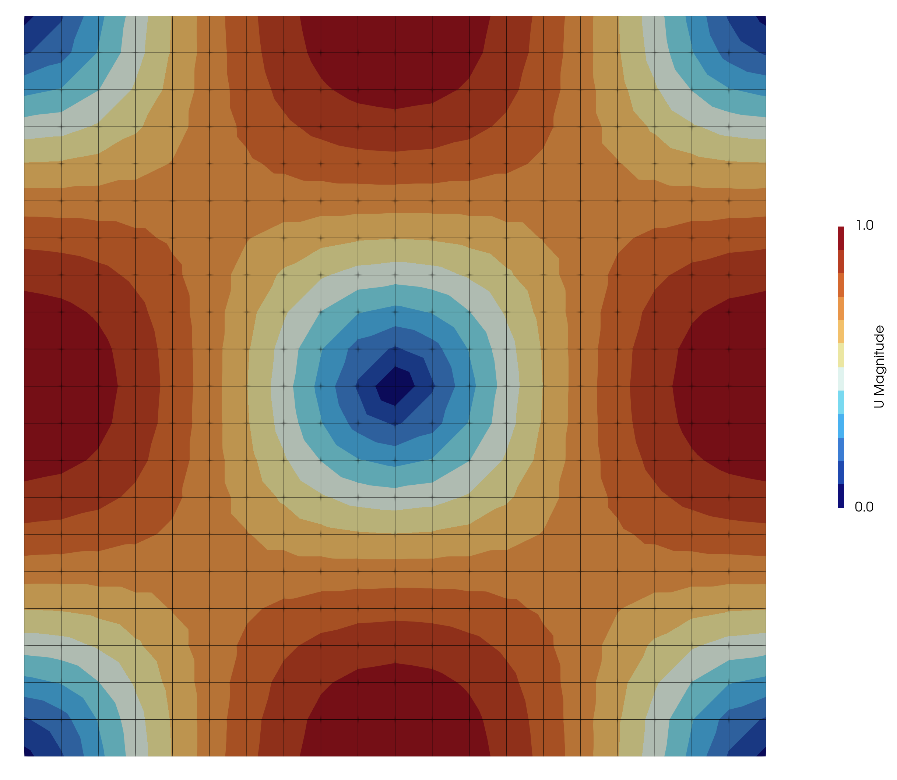
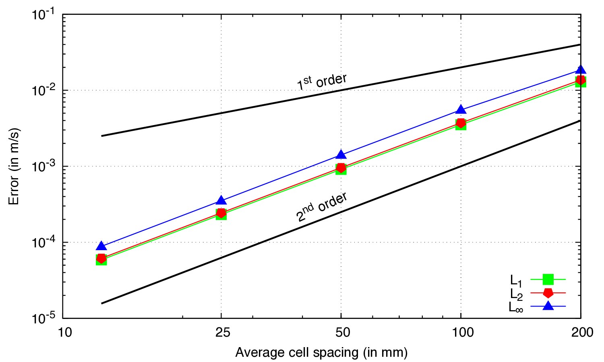

# Decaying Taylor-Green vortex flow: `decayingTaylorGreenVortex`

---

## Tutorial Aims

- Benchmarks the accuracy and order of accuracy of the `newtonIcoFluid` coupled
  Newton-Raphson fluid solver against the analytical solution for the decaying
  Taylor-Green vortex flow case.

## Case Overview

The 2-D, transient Taylor–Green decaying vortex flow has an analytical solution
for an incompressible laminar, viscous fluid [^erzincanli2013]. Consequently,
the case is well-suited for benchmarking the accuracy and order of accuracy
(spatial and temporal) of a discretisation. The spatial domain is taken here as
the unit square $[0, 1] \times [0, 1]$ m and the analytical solution in
non-dimensional form is given by

$$
u(x, y, t) = e^{-2\pi^2 t/\text{Re}} \sin(\pi x) \cos(\pi y) \\
v(x, y, t) = -e^{-2\pi^2 t/\text{Re}} \cos(\pi x) \sin(\pi y) \\
p(x, y, t) =
    e^{-4\pi^2 t/\text{Re}} \frac{1}{4}
    \left[\cos(2\pi x) + \sin(2\pi y)\right] + C
$$

where $u$ is the non-dimensional $x$ component of velocity, $v$ is the
 non-dimensional $y$ component of velocity, $p$ is the non-dimensional
 pressure, $t$ is time, $Re$ is the Reynolds number taken here to be $10$,
 and $C$ is an arbitrary constant.

The time-varying analytical solution for velocity is prescribed as a boundary
 condition using the `codedFixedValue` boundary condition as follows:

```c++
    walls
    {
        type            codedFixedValue;
        name            decayingTaylorGreenVortexVelocity;

        code
        #{
            const scalar Re = 10;
            const scalar t = db().time().value();
            const scalar pi = constant::mathematical::pi;
            const scalar A = Foam::exp(-2.0*sqr(pi)*t/Re);

            const scalarField x(patch().Cf().component(vector::X));
            const scalarField y(patch().Cf().component(vector::Y));

            const vectorField velocity
            (
                A*Foam::sin(pi*x)*Foam::cos(pi*y)*vector(1, 0, 0)
              - A*Foam::cos(pi*x)*Foam::sin(pi*y)*vector(0, 1, 0)
            );

            operator==(velocity);
        #};

        value           uniform (0 0 0);
    }
```

For pressure, a zero gradient condition is assumed:
 $\boldsymbol{n} \cdot \boldsymbol{\nabla} p = 0$;
 consequently, the pressure field is defined up to a constant. To deal with
 this in the current case, the pressure in the cell closest to the centre of
 the domain is fixed to 0.

A utility called `initialiseTaylorGreenVortex` is provided in the case, which
 initialises the internal velocity and pressure fields to the analytical
 solution at $t = 0$ s. The initial velocity magnitude field is shown in
 Figure 1.



**Figure 1: The velocity magnitude field at the initial time.**

A structured $20 \times 20$ quadrilateral mesh is employed constructed with
 `blockMesh`; however, the case contains `blockMeshDict` files with coarser and
 finer resolutions to allow a mesh sensitivity study to be easily performed,
 e.g. `cp system/blockMeshDict.4 system/blockMeshDict && blockMesh`.

The case contains a function object, which calculates the exact velocity field
 `exactU` and the error norm in the velocity field ($L_1$, $L_2$, and
 $L_\infty$) at $t = 0.4$ s, as defined at the bottom of
 `system/controlDict`:

```c++
functions
{
    error
    {
        name    error;
        type    coded;
        libs    (utilityFunctionObjects);

        codeEnd
        #{
            // Define the exact U
            const scalar Re = 10;
            const scalar t = time().value();
            const scalar pi = constant::mathematical::pi;
            const scalar A = Foam::exp(-2.0*sqr(pi)*t/Re);

            volVectorField exactU
            (
                IOobject
                (
                    "exactU",
                    time().timeName(),
                    mesh(),
                    IOobject::NO_READ,
                    IOobject::AUTO_WRITE
                ),
                mesh(),
                dimensionedVector(dimVelocity, Zero)
            );

            {
                const scalarField x(mesh().C().component(vector::X));
                const scalarField y(mesh().C().component(vector::Y));

                exactU.primitiveFieldRef() =
                    A*Foam::sin(pi*x)*Foam::cos(pi*y)*vector(1, 0, 0)
                  - A*Foam::cos(pi*x)*Foam::sin(pi*y)*vector(0, 1, 0);
            }

            forAll(exactU.boundaryField(), patchI)
            {
                if (exactU.boundaryField()[patchI].size())
                {
                    const scalarField x
                    (
                        mesh().C().boundaryField()[patchI].component(vector::X)
                    );
                    const scalarField y
                    (
                        mesh().C().boundaryField()[patchI].component(vector::Y)
                    );

                    exactU.boundaryFieldRef()[patchI] =
                        A*Foam::sin(pi*x)*Foam::cos(pi*y)*vector(1, 0, 0)
                      - A*Foam::cos(pi*x)*Foam::sin(pi*y)*vector(0, 1, 0);
                }
            }

            exactU.correctBoundaryConditions();

            Info<< "Writing exactU to " << time().timeName() << endl;
            exactU.write();

            // Lookup U
            const auto& U = mesh().lookupObject<volVectorField>("U");

            // Calcalulate the average
            // Calculate the error
            const vectorField diff(U - exactU);
            const scalar errorL1(gAverage(mag(diff)));
            const scalar errorL2(sqrt(gAverage(magSqr(diff))));
            const scalar errorLInf(gMax(mag(diff)));

            Info<< "Velocity errors norms:" << nl
                << "    mean L1 = " << errorL1 << nl
                << "    mean L2 = " << errorL2 << nl
                << "    LInf = " << errorLInf << endl;
        #};
    }
}
```

In this case, the `newtonIcoFluid` fluid solver is used, which solves the
 incompressible Navier-Stokes equations using a Jacobian-free Newton-Krylov
 approach built on the PETSc SNES nonlinear solver. The `newtonIcoFluid`
 settings are defined in `constant/fluidProperties`, where three types of
 settings are given: (i) numerical smoothing parameter for quelling
 checkerboarding oscillations, (ii) pressure reference point, and (iii) the
 PETSc options file, where the PETSc SNES nonlinear solver settings are defined.

```c++
fluidModel newtonIcoFluid;

newtonIcoFluidCoeffs
{
    // Smoothing terms
    // Trottenberg gives 1/16 for Stokes flow
    omega     [0 -2 1 0 0 0 0] 0.0625;
    localReRef 1e6;
    omegaExponent 1.0;
    alphaU    1.0;

    // Set the pressure to zero at the centre cell
    pRefPoint (0.5 0.5 0);
    pRefValue 0.0;

    // PETSc options file used by PETSc SNES
    optionsFile petscOptions.lu;
}
```

The `petscOptions.lu` file currently specifies a Jacobian-free Newton-Krylov
 solution approach, where the approximate Jacobian is inverted using a direct LU
 solver and L-GMRES is used as the iterative linear solver. Key settings from
 `petscOptions.lu` are shown below:

```bash
-snes_type newtonls
-snes_linesearch_type l2
-snes_max_it 1000
-snes_monitor
-snes_converged_reason
-snes_mf
-snes_mf_operator
-ksp_type lgmres
-ksp_gmres_restart 400
-ksp_converged_reason
-ksp_max_it 400
-pc_type bjacobi
-sub_pc_type lu
```

## Running the Case

The tutorial case is located at
`solids4foam/tutorials/fluids/decayingTaylorGreenVortex`. The case can be
run using the included `Allrun` script, i.e. `./Allrun`. The `Allrun` script
first performs five steps, as described below:

```bash
# Build the utility for initialising the solution
wmake initialiseTaylorGreenVortex

# Copy 0.orig to 0
restore0Dir

# Create the mesh
runApplication blockMesh

# Initialise the velocity and pressure initial fields with the analytical
# solutions
runApplication initialiseTaylorGreenVortex

# Run the solver
runApplication solids4Foam
```

## Expected Results

According to the analytical solutions given above, the magnitude of the velocity
 and pressure decrease in time, resulting the decay of the vortex. An animation
 of the velocity magnitude from $t = 0$ s to $t = 0.4$ s is shown in Video 1.
 The velocity streamlines, shown in black, are seen to remain stationary as the
 direction of the velocity field remains unchanged in time; instead, only its
 magnitude decreases.


**Video 1: Evolution of the velocity magnitude field**

The function object described above prints out the velocity field error norms at
 the end of the run after the last time step finished:

```bash
...

Time = 0.4

Evolving fluid model: newtonIcoFluid
Solving the fluid for U and p
  0 SNES Function norm 4.822871490313e-03
    Linear solve converged due to CONVERGED_RTOL iterations 2
  1 SNES Function norm 6.547206455521e-09
    Linear solve converged due to CONVERGED_RTOL iterations 2
  2 SNES Function norm 3.778722236831e-14
  Nonlinear solve converged due to CONVERGED_FNORM_RELATIVE iterations 2
ExecutionTime = 4.12 s  ClockTime = 5 s

Writing exactU to 0.4
Velocity errors norms:
    mean L1 = 0.000910565
    mean L2 = 0.000957898
    LInf = 0.00140902

End
```

Re-running the case for different mesh densities allows the order of accuracy of
 the solver to be assessed. Below the errors are given for five mesh spacings,
 where a spacing of $0.05$ m corresponds to the $20 \times 20$ grid described
 above ($1$ m divided into $20$ gives $0.05$ m).

```text
# dx L1 L2 LInf
0.2 0.0128716 0.013683 0.0185237
0.1 0.00352244 0.00372265 0.00551404
0.05 0.000910565 0.000957898 0.00140902
0.025 0.000232169 0.000243816 0.000352236
0.0125 5.86993e-05 6.15957e-05 8.84018e-05
```

Plotting these errors on a log-log plot demonstrates that second-order is
 achieved as expected (Figure 2), where the $L_\infty$ (maximum) errors are
 larger than the $L_1$ and $L_2$ (average) errors, which is also as
 expected.



**Figure 2: The velocity error norms as a function of mesh spacing.**

## References

[^erzincanli2013]: [Erzincanli, B. and Sahin, M. (2013). An arbitrary
    Lagrangian–Eulerian formulation for solving moving boundary problems with
    large displacement and rotations, Journal of Computational Physics 255
    (2013) 660–679](https://doi.org/10.1016/j.jcp.2013.08.038)
